給与明細pdf保存手順
===

# 概要

1. pdf取得
2. ファイル(Files)から、slackへ送信
3. pdfの削除

# 詳細

## 1. pdf取得

1. safari等で、pdfを開き、詳細（赤枠）を開く
	* 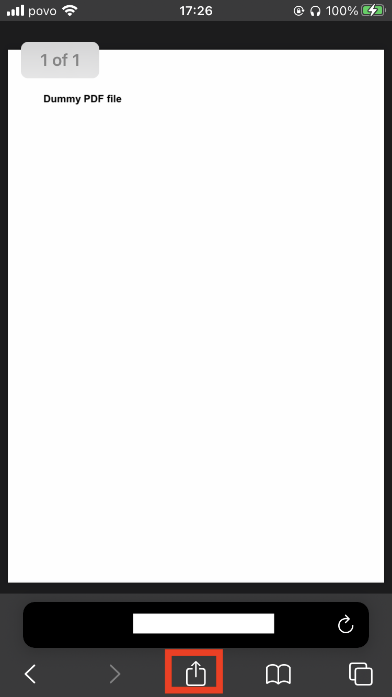
2. 詳細を上にスワイプする
	* 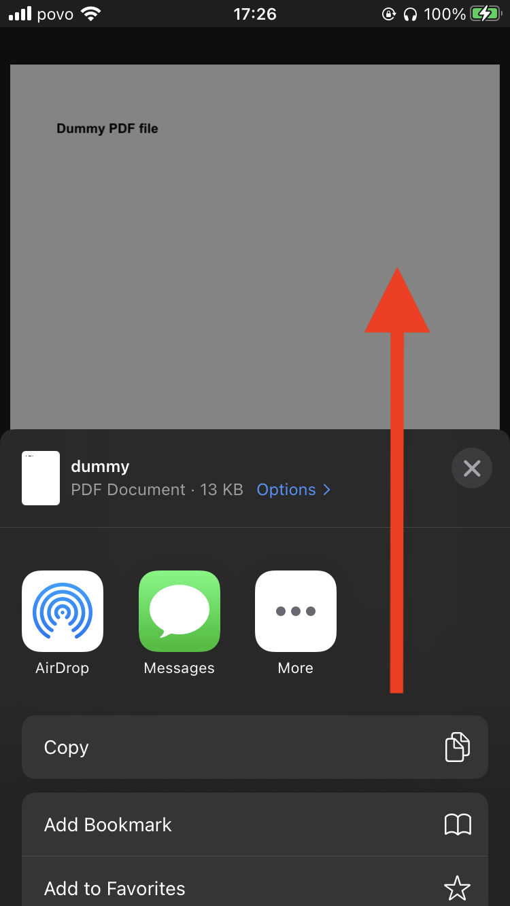
3. 下部にある、`Save to Files` を開く
	* 
4. `On My iPhone` を一度タップし、`Save`を選択
	* 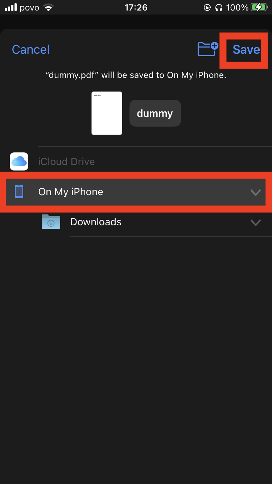

## 2. ファイル(Files)から、slackへ送信

1. home画面から、`Files`を開く
	* 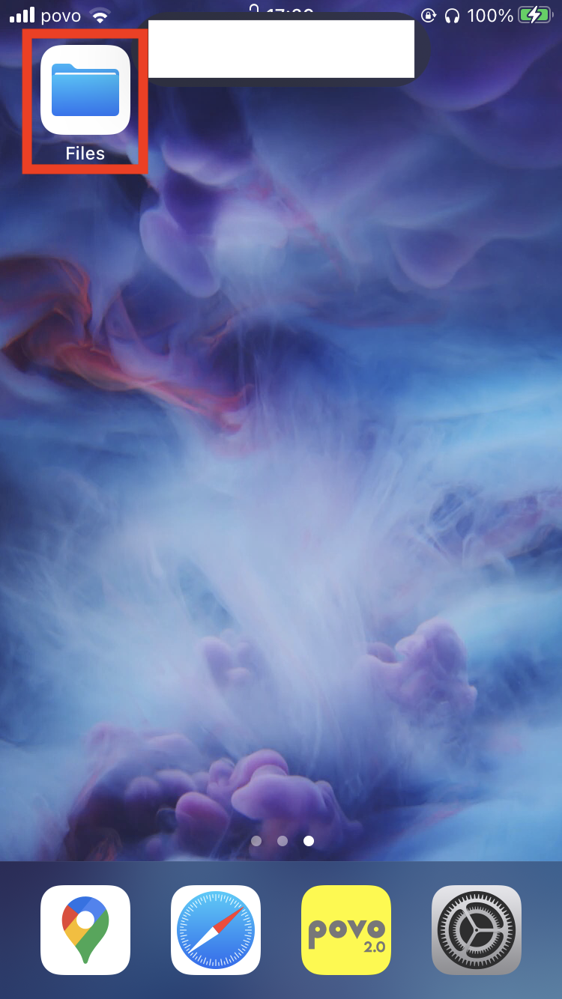
2. `Browse`から、`On My iPhone` を選択
	* 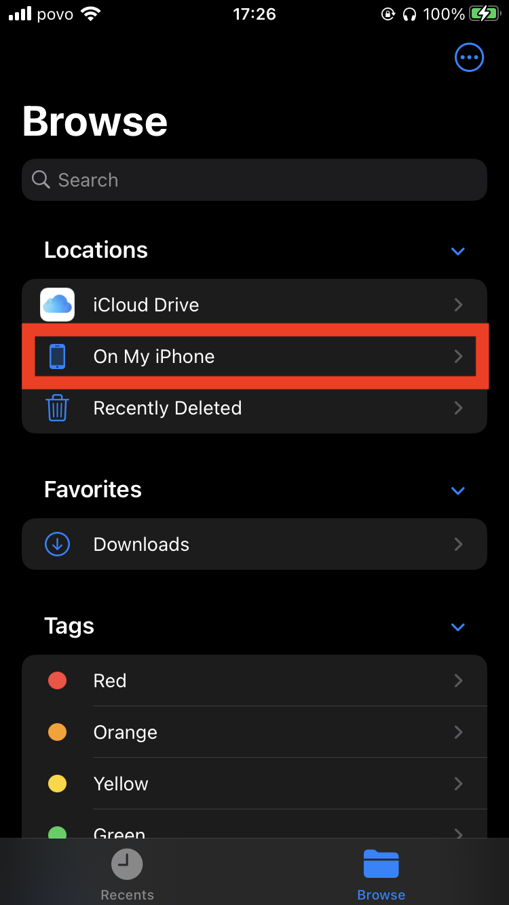
3. 先ほど保存したファイルを選択する
	* 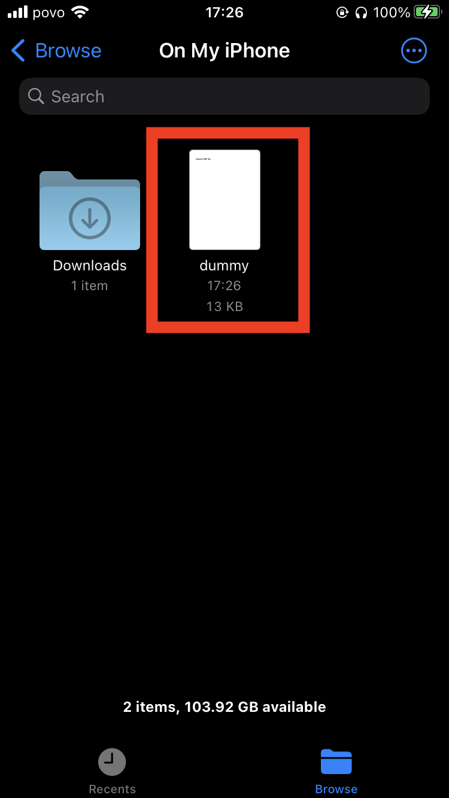
4. 右下の詳細を開く
	* 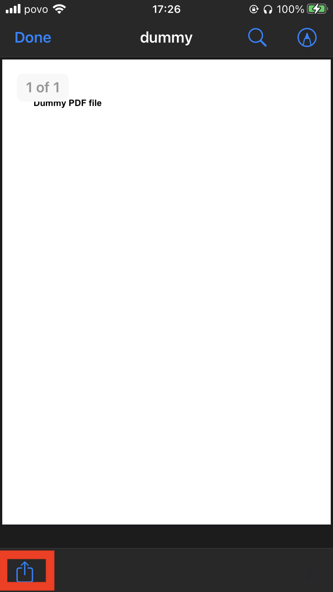
5. `More`を開く
	* 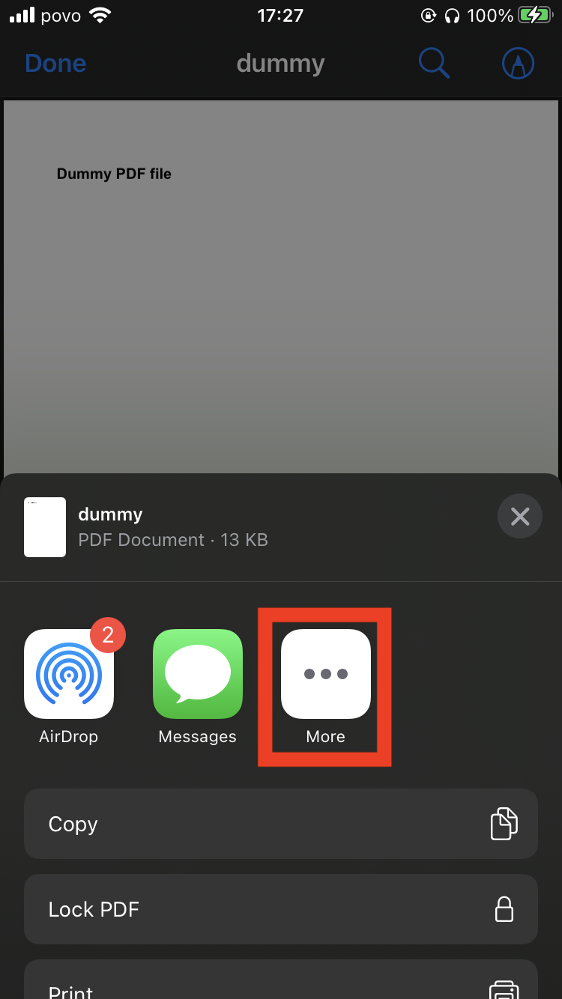
6. `Apps`から、`Slack`を選択
	* 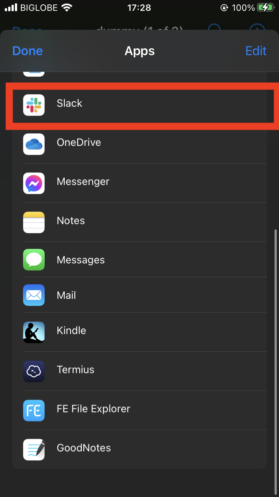
7. `Share to Slack` の画面から、`Workspace`と`Destination`が合っていることを確認し、送信ボタン（赤枠）を選択
	* 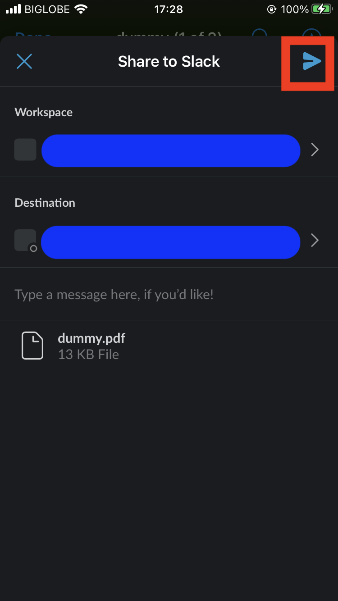
8. 送信完了

## 3. pdfの削除

1. home画面から、`Files`を開く
	* 
2. `Browse`から、`On My iPhone` を選択
	* 
3. 先ほど保存したファイルを長押しする
	* 
3. `Delete`を選択し、削除する
	* 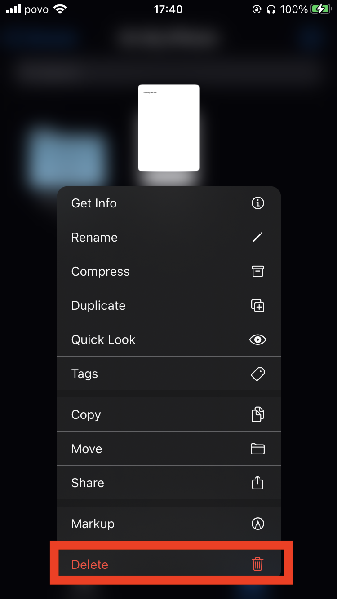
